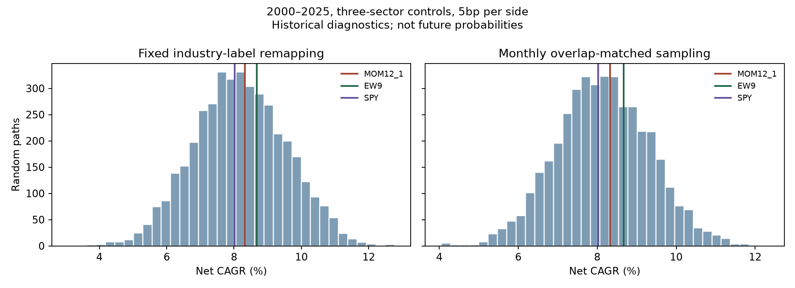
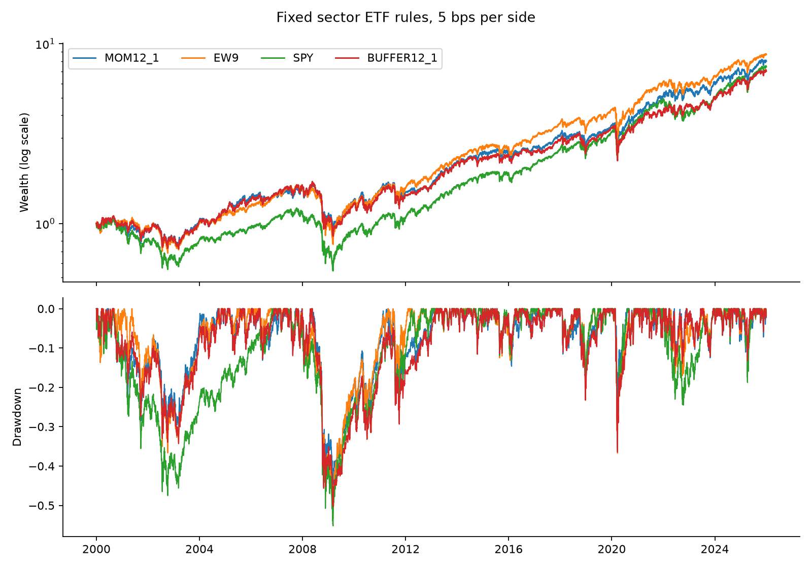

# Sector ETF Momentum Review

A hypothetical US equity portfolio manager is considering a sector rotation sleeve. This project asks whether a fixed momentum rule adds enough **net value over sector equal-weighting** to justify its trading and active risk.

**Phase one is complete: the evidence does not justify adding the proposed momentum sleeve to the simulated manager's existing SPY policy allocation.** Over 2000–2025, at an assumed 5 bps per side:

| Portfolio | Net CAGR | Daily maximum drawdown |
|---|---:|---:|
| Nine-sector equal-weighting (EW9) | 8.68% | −53.29% |
| MOM12−1, three sectors | 8.32% | −46.20% |
| Buy-and-hold SPY | 8.02% | −55.19% |

Momentum beat SPY on full-period CAGR but lagged EW9; its shallower historical drawdown is a separate risk outcome. EW9's historical ranking is not evidence that all passive strategies beat all active strategies. The primary mean active return versus EW9 was −0.28 percentage points per year, and its uncertainty interval crossed zero. Subsequent mechanism, environment and external-data checks did not establish a reliable way to decide in advance when this nine-ETF rule should be enabled.

The new [concentrated controls](reports/random_control_snapshot/README.md) place momentum CAGR around the **55th–56th historical percentile** under identity remapping and monthly overlap matching. This diagnostic does not show a pronounced return advantage from the selected industry identities; momentum's shallower historical drawdown remains a separate observation. These percentiles are not significance tests or future success probabilities.



[Final review (中文)](docs/final_review_zh.md) · [Final manager memo](docs/final_manager_memo.md) · [Research plan (中文)](docs/research_plan_zh.md) · [Investment case (中文)](docs/investment_case_zh.md)

## Evidence map

| Stage | Question | Evidence |
|---|---|---|
| Original investment review | Does the fixed rule add net value and fit the account? | [Original snapshot](reports/snapshot), including its unchanged [generated memo](reports/snapshot/manager_memo.md) |
| Period and universe exploration | Where did it succeed or fail? | [Complete period grid and eleven-sector sensitivity](reports/exploratory_snapshot/regime_comparison_zh.md) |
| Mechanism and conditions | What explains realized P&L, and can known conditions improve the rule? | [Effectiveness study](reports/effectiveness_snapshot/industry_rotation_effectiveness_zh.md), [frozen protocol](reports/effectiveness_snapshot/research_protocol_zh.md), independent audits and French ten-industry replication |
| Concentrated control | Does the ranking add value beyond holding three sectors? | [Industry-identity random remapping](reports/random_control_snapshot/README.md), with an overlap-matched monthly sensitivity |

The original snapshot remains unchanged. Its six-month circular-block interval for annualized arithmetic active return is [−2.76, +2.05] percentage points (2,000 draws, seed 2026). The follow-up calculation reports [−2.62, +2.07] (20,000 draws, seed 20261004), with block-length sensitivity and separate statistical settings recorded in its protocol. Both intervals cross zero; neither is a confidence interval for CAGR or a future profit probability.

## Favorable and unfavorable paths

The unchanged nine-sector rule produces all four outcomes: 2022 gained **9.48%** and beat EW9; 2011 lost **2.16%** and lagged EW9; 2006 made money but lagged EW9; 2002 lost money but lost less than EW9. These are net calendar-year returns, rather than CAGRs. Energy holdings contributed +18.58 percentage points in 2022 and −4.75 points in 2023; these are portfolio P&L contributions, not XLE buy-and-hold returns.

A separate **2020–2025 common-start test** adds XLRE and XLC to cover all eleven sector products. Both universes are formed from cash on the same date, using unchanged signals, execution and costs. Eleven-sector momentum earned **16.48% CAGR**, versus **11.97%** for EW11 and **14.80%** for SPY; the comparable nine-sector momentum account earned **14.55%**. The expanded strategy still lagged EW11 in 2021 and 2023, and both added sectors had negative contribution years.

The [exploratory snapshot](reports/exploratory_snapshot) discloses all 26 calendar years, five non-overlapping five-year blocks plus the remaining year, and all 277 overlapping three-year windows. Highlighted examples are chosen after observing this grid. They describe historical conditions; they do not provide a tested rule for recognizing a favorable regime in advance or change the primary full-history conclusion.

## The decision and the rules

The simulated manager starts with a SPY reference account and considers a 20% sector sleeve. Every month, the primary rule selects three of the nine original Select Sector SPDR ETFs: XLK, XLF, XLE, XLY, XLP, XLV, XLI, XLB and XLU. The selected ETFs receive equal target weights.

At month-end `m`, the signals are:

| Fixed rule | Adjusted-level ratio | Purpose |
|---|---|---|
| MOM12−1 (primary) | `P[m−1] / P[m−12] − 1` | Eleven monthly returns, skipping the latest month |
| MOM12−0 | `P[m] / P[m−12] − 1` | Check whether omitting the latest month matters |
| MOM1 | `P[m] / P[m−1] − 1` | Compare with short-horizon rotation |
| Buffer12−1 | Same primary signal; retain incumbents ranked ≤4 | Test trading savings and delayed replacement together |

Monthly trading is separate from the signal horizon. A December 1999 decision is executed at the first January 2000 trading day's **close**. Old holdings earn execution-day returns; new holdings start earning returns on the following session. A $1m initial cash baseline includes formation fees, and the final holdings are valued without liquidation.

Benchmarks use the same accounting engine: monthly EW9 and buy-and-hold SPY. Full accounts include 80% SPY / 20% MOM, 80% SPY / 20% EW9, 80% SPY / 20% buffer, and a fixed 10% momentum sensitivity case. They are simulated directly, including drift and rebalancing costs.

## What is implemented

- Strict adjusted-level inputs, preserved supplier action fields, snapshot hashes, and full XNYS trading-session coverage checks.
- Daily position drift and self-financing costs charged on actual purchases plus sales; fixed 0/5/10 bps scenarios.
- Continuous backtests with development (2000–2010), confirmation (2011–2017), and final historical (2018–2025) summaries.
- Paired active-return block bootstrap, tracking error/IR, worst rolling twelve-month outcomes, and SPY-proxy CAPM with French monthly RF and HAC uncertainty.
- Four diagnostic episodes: dot-com decline, financial crisis decline, COVID decline/rebound, and 2022 inflation/rate shock.
- Auditable signal dates/endpoints/ranks, execution dates, pretrade/target weights, fees, daily weights, and dollar P&L by ETF. P&L contributions reconcile to wealth changes; they are not factor attribution.

The skip-month convention comes from individual-stock momentum research; it is a testable choice here, not an established optimum for sector ETFs. See [French's momentum definition](https://mba.tuck.dartmouth.edu/pages/faculty/ken.french/data_library/det_mom_factor.html) and [AQR's discussion of style implementation](https://www.aqr.com/-/media/AQR/Documents/Insights/Journal-Article/JOIM-Investing-With-Style.pdf).

## Reproduce

Python 3.12 is recommended. From this repository's root:

```bash
python3 -m venv .venv
source .venv/bin/activate
pip install '.[download,plots]'
python -m unittest discover -s tests -v
python -m sector_momentum download --out data/raw
python -m sector_momentum run --prices data/raw/total_return.csv --rf data/raw/risk_free.csv --out reports/local
```

Inputs are downloaded from Yahoo Finance via yfinance and the French data library. The required warm-up starts on 1998-12-31; the trading sample ends on 2025-12-31. Missing observations cause a failure, not interpolation or forward-filling. The supplier end date is exclusive (`2026-01-01`).

To use your own licensed data, provide `date` plus the ten ticker columns as **positive adjusted levels**, not returns. Monthly RF is a separate `date,rf` CSV in decimal units. Without `--rf`, the report explicitly labels a zero-RF market regression rather than a fully specified CAPM.

Offline synthetic demonstration:

```bash
python -m sector_momentum demo --out reports/demo
```

Synthetic output is marked throughout and is not historical ETF performance. Tests run offline and do not require Yahoo, network access, or matplotlib. The current offline suite passed all **65 tests** locally, including concentrated-control accounting and timing checks. The original snapshot's 57-test record is retained as historical provenance. GitHub Actions runs the offline suite on every push to main and on pull requests ([workflow](.github/workflows/tests.yml)). The initial verified run's direct package versions are in [requirements-reproduce.txt](requirements-reproduce.txt); they are not a complete transitive lockfile.

To reproduce the complete period grid and the eleven-sector sensitivity test:

```bash
python -m sector_momentum explore --prices data/raw/total_return.csv --download-extra --out reports/exploration
```

The additional products are downloaded only over their available history. Their adjusted levels are combined with the saved original nine/SPY snapshot; base data are not silently replaced. To reuse the saved expansion, replace `--download-extra` with `--expanded-prices data/raw/extended/universe11.csv`. Omitting both options generates the original nine-sector period diagnostics only. Source changes require reinstalling the package.

The follow-up effectiveness scripts and reproduction steps are described in [their snapshot README](reports/effectiveness_snapshot/README.md). The 2010–2025 filter comparison forms all accounts from cash on the same date; it is not a slice of the account formed in 2000. French ten-industry monthly research portfolios use a theoretical month-end implementation and a different industry classification; they cannot reproduce the ETF next-session close delay or historical underlying-stock execution costs.

To reproduce the concentrated controls from the same saved price input:

```bash
python -m sector_momentum random-control --prices data/raw/total_return.csv --out reports/random_local
```

The default run uses 4,096 paths per method, fixed seeds, and all 0/5/10 bps scenarios. `--no-plots` omits figures. The [protocol](research/random_control_protocol_zh.md) freezes identity remapping and monthly overlap-matched sensitivity before this diagnostic is run. Actual costs and turnover are recomputed for every path. Historical percentiles describe this sample and construction; they are not alpha p-values or future win probabilities.

## Evidence and limits

The published [snapshot](reports/snapshot) contains derived tables, figures, provenance and a manager memo. The [data quality record](reports/snapshot/data_quality.json) includes a supplier XLU split spot-check and daily P&L reconciliation. Raw vendor prices/actions and local audit files are excluded from Git. Download again to reproduce locally; a different vendor revision can produce different hashes and results.



The 20% momentum account's full-period tracking error versus SPY is 1.60%, below the illustrative 2% budget. Passing that risk check does not rescue weak net-return evidence. The manager can retain the baseline allocation and request prospective evidence before reconsidering the rule.

This is retrospective research with known historical events, simulated close fills and flat fee assumptions. Yahoo adjusted levels are a supplier total-return proxy; dividends must not be added again. ETF operating expenses are already reflected in the historical fund path; the bps scenarios add trading costs. They do not independently verify corporate actions or model tax, historical spreads, market impact, auction fills or $100m capacity. The original nine ETF products also change their underlying sector exposures over time. A CAPM intercept does not establish causal alpha. The concentrated random control is a historical diagnostic, not a new independent holdout or proof of an economic cause.

The simulated manager retains the existing SPY policy allocation rather than selecting EW9 solely because it won this sample. Reconsideration requires frozen decision records, additional independent evidence, and explicit implementation and account-risk review. Studying why industry advantages persist would require information available at the time—such as earnings expectations or valuations—and a new protocol. Repeatedly changing thresholds on the same historical sample is not the next stage of validation. See the [final memo](docs/final_manager_memo.md).

***REMOVED***
