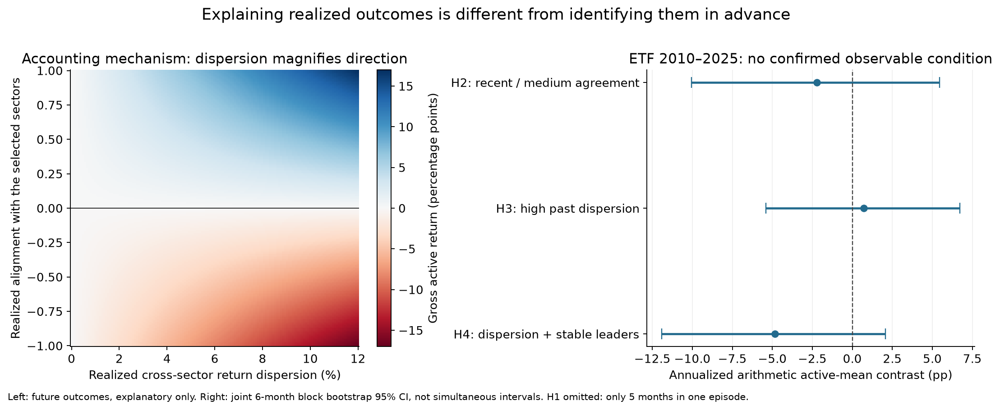
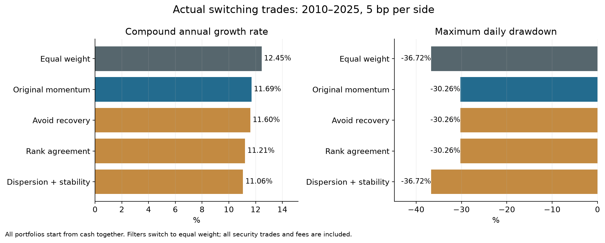

# When sector rotation works: return mechanisms, ex-ante conditions and evidence strength

Research date: 2026-10-04. The strategy uses nine sector ETFs, MOM12−1, equal weights in the top three and monthly rotation; the primary cost is 5 bp per side. This report separately tests explanations of actual P&L, information available before trading and actual trading-filter performance.

## Main finding

**The mechanism by which sector rotation gains or loses relative return can be explained with high confidence. This analysis has not identified an environment switch that determines in advance, with high confidence, when to enable it.**

A necessary return condition is that selected sectors outperform omitted sectors during the actual holding period by enough to cover additional trading costs. Greater industry dispersion creates more room for gains or losses; selecting the side that subsequently leads determines the direction. When long-horizon rankings lag changing leadership, concentration can turn a past advantage into a new loss. Precise ledger reconciliation supports this mechanism, but future holding-period industry returns are not observable in advance.

Four limited hypotheses calculable before trading, three actual switching filters and official ten-industry historical replication did not identify a condition for the modern nine ETFs that meets this analysis's confidence standard. Long external industry histories support the possibility of industry momentum and retain a local clue about recovery-after-decline risk, but do not directly supply a nine-ETF trading rule.

## 1. Definition of effectiveness and research scope

Value from industry selection is assessed through active return over a monthly equal-weight portfolio in the same universe after fees. A profitable strategy may merely benefit from a rising equity market; losing less than a benchmark creates relative value but is not absolute principal protection. SPY provides an additional broad-market and exposure reference.

| Evidence layer | Data and tests | Question answered |
|---|---|---|
| P&L mechanism | ETFs, 2000–2025; 312 calendar months, 311 complete execution intervals, sector P&L and fees | How realized advantages or losses arose |
| Ex-ante conditions | Threshold calibration in 2000–2009; inference in 2010–2025; four fixed conditions | Whether information known at the decision distinguishes subsequent net active returns |
| Actual filters | 2010–2025; same-date formation from cash; three filters, two controls, 0/5/10 bp | Whether switching to equal weight using the conditions actually improves performance |
| External transfer | French ten-industry value-weighted research portfolios, 1960–2025 | Whether findings persist under different industry definitions and earlier history |

All original ETF history had already been examined, so these time splits are retrospective checks. Freezing a limited hypothesis set reduces additional selection in this round but cannot remove prior exploration bias. External historical replication is not a genuinely prospective trading test either. See the [research protocol](research_protocol.md) for complete rules.

## 2. Return identities: dispersion, direction and costs

Let S be the average return of the three selected sectors over the actual holding interval, and O the average return of the six omitted sectors. Gross active return after execution satisfies exactly:

> Gross active return = ⅔ × (S − O)

Subtracting the relative fee effect calculated from each portfolio's actual trades and self-financing path gives net active return. Across 311 complete execution intervals, the maximum net-return bridge error is below 9×10⁻¹⁶. Each interval is valued from after the current execution close to before the following execution; the current execution fee belongs to that interval. Calendar-month performance still includes the final December 2025 month.

Gross active return also equals √2 × the population standard deviation of holding-period industry returns × the cross-sectional correlation between the selection indicator and industry returns. This separates the size of industry return differences from whether selected industries subsequently lead or lag:

- Large dispersion with subsequent leaders selected: larger positive active return.
- Large dispersion with previous winners reversing: larger negative active return.
- Small dispersion: concentration may receive insufficient compensation, making additional costs more likely to consume any advantage.

These are realized P&L conditions. The left side of the figure uses future holding-period returns and cannot be an ex-ante environment filter.

The average relative fee effect across complete intervals is about 2.12 bp. Using that historical average only to illustrate scale, the selected-minus-omitted mean return spread must exceed approximately 3.18 bp to cover it. Actual fees, weights and market paths vary; this is not a fixed predictive threshold ready for trading.

## 3. How often do previous winners continue to lead?

Across complete ETF intervals, the mean Spearman IC between past momentum rankings and subsequent industry-return rankings is **0.00472**, with a six-month-block 95% interval of **[−0.0364, 0.0464]**. Historical rankings do not show a confirmed stable ranking advantage in this sample. An IC near zero does not rule out other signals, universes or nonlinear models.

The selected top three overlap with the subsequently realized top three by an average of 1.013 sectors, with a 95% interval of [0.945, 1.080]. The mathematical expected overlap when choosing three of nine at random is one. This is an intuitive mechanism reference, not a random-portfolio return test.

Across all 312 calendar months, annualized arithmetic net active return is **−0.28 percentage points**, with a 95% interval of **[−2.62, +2.07] percentage points**. Gross advantage is approximately −0.02 percentage points per year, with additional costs of about 0.26 percentage points per year. Removing fees does not establish a stable positive advantage. Annualized arithmetic active means and differences in strategy CAGR are different measures.

Mean active return remains negative in 25 of 26 leave-one-year-out checks. Removing 2022 gives approximately −0.87 percentage points per year. Favorable years have a substantial influence; deleting unsuccessful years would not establish effectiveness.

## 4. Results for four conditions observable before trading

The four conditions were written into the frozen protocol first. H1 checks a negative past 24-month market return with a recent three-month recovery. H2 checks agreement between recent three-month industry rankings and intermediate scores. H3 checks signal dispersion above the 2000–2009 calibration median of 11.79%. H4 requires both H3 and at least two sectors shared by the most recent three top-three lists. Every input ends at the preceding month-end.

The table reports 2010–2025 net active returns at 5 bp per side. The contrast is condition true minus condition false: H1's hypothesized direction is negative, while the others are positive. Intervals use 20,000 joint circular-block draws of six months. They are not simultaneous, multiplicity-adjusted intervals. The adjacent p-values use HAC12 and one Holm-eight family covering four contrasts and four expected favorable-group means.

| Condition | True months/state runs | Mean active/month when true | When false/month | Annualized arithmetic contrast | 95% interval, annualized percentage points | Contrast Holm p |
|---|---:|---:|---:|---:|---:|---:|
| H1: recovery after decline | 5/1 | 0.34% | −0.06% | +4.79 percentage points | Insufficient sample for reliable interval inference | Insufficient sample; significance not interpreted |
| H2: recent/intermediate agreement | 143/28 | −0.10% | 0.09% | −2.23 percentage points | [−10.05, +5.45] | 1.000 |
| H3: large historical signal dispersion | 59/15 | −0.01% | −0.07% | +0.73 percentage points | [−5.40, +6.71] | 1.000 |
| H4: large dispersion and stable lists | 48/17 | −0.35% | 0.05% | −4.84 percentage points | [−11.91, +2.07] | 1.000 |

**None of the four is confirmed.** H1 has only five months in early 2010 and one consecutive episode, insufficient for a reliable general recovery-state conclusion. In six-/twelve-month resampling, 18.15%/24.29% of draws do not contain both states. Reference CSV intervals omit those draws, making the distributions conditional on sampling the state, rather than ordinary reliable 95% intervals; they are therefore suppressed in this table. H2's direction reverses between 2010–2017 and 2018–2025. H3 appears slightly favorable, but its contrast becomes negative without 2022. H4 has worse average active return when true, yet its interval crosses zero; that does not justify reversing the hypothesis into “stability is necessarily harmful.”

The fixed auxiliary regression allows beta to vary by state: active ~ constant + state + contemporaneous SPY return + state × SPY return. It does not turn the modern ETF conditions into robust evidence. Contemporaneous market return describes exposure, not a trading input; controlling for total market return is not complete factor-risk attribution.

## 5. Did actually using the conditions improve the strategy?

All accounts form from cash on the same date in 2010. Filters switch to EW9 when momentum is disabled, calculating actual cross-mode buys/sells, weight drift and fees. They do not splice the original strategies' monthly returns.

| Portfolio | Net CAGR | Daily maximum drawdown | Momentum months/192 | Mode switches |
|---|---:|---:|---:|---:|
| Always equal weight | 12.45% | −36.72% | 0/192 | 0 |
| Original momentum | 11.69% | −30.26% | 192/192 | 0 |
| F1: equal weight during recovery | 11.60% | −30.26% | 187/192 | 1 |
| F2: momentum with ranking agreement | 11.21% | −30.26% | 143/192 | 54 |
| F3: momentum with dispersion and stability | 11.06% | −36.72% | 48/192 | 33 |

None improves original momentum CAGR or exceeds EW9. Complete 0- and 10-bp results are retained rather than choosing the best rule by cost assumption. F2 has more cross-mode trades, showing that an environment filter can itself add friction. F3 has fewer concentrated months but a deeper maximum drawdown than original momentum: lower holding frequency does not automatically reduce tail risk.

The three filters against EW9 and original momentum form a separate six-test HAC/Holm family. None has a confirmed positive increment. Paired six-/twelve-month-block return-difference intervals also cross zero. Always-momentum and always-equal-weight degeneration cases match the original engine daily at 0/5/10 bp; see `ledger_validation.csv` for errors.

## 6. What do earlier and broader industry data show?

The [official Kenneth French ten-industry value-weighted portfolios](https://mba.tuck.dartmouth.edu/pages/faculty/ken.french/Data_Library/det_10_ind_port.html) classify NYSE, AMEX and NASDAQ stocks by four-digit SIC at June-end and calculate returns from July through the following June. Industry definitions, stock weights and investability differ from the nine SPDR GICS sector ETFs. Monthly data allow theoretical month-end formation, not replication of next-trading-close ETF execution. Five bp is a comparable research assumption for outer-basket trading, not an estimate of historical underlying-stock implementation costs.

| French ten-industry period | Momentum net CAGR | EW10 net CAGR | Annualized arithmetic active mean | Six-month-block 95% interval |
|---|---:|---:|---:|---:|
| 1960-01 to 1999-12 | 14.36% | 12.61% | +1.78 percentage points | [−0.09, +3.70] percentage points |
| 2000-01 to 2025-12 | 10.73% | 9.11% | +1.73 percentage points | [−1.16, +4.80] percentage points |
| 1960-01 to 2025-12 | 12.91% | 11.22% | +1.76 percentage points | [+0.13, +3.43] percentage points |

The full 1960–2025 external history supports the possibility of industry momentum: the active-mean intervals remain positive with three-, six- and twelve-month blocks. Evidence in the separate early and modern periods is weaker. After Holm correction across three primary basic-mean HAC tests, the full-period p-value is approximately 0.076. This is a supported historical result, not proof that every industry universe is effective.

The same four environment hypotheses are unconfirmed in French 2000–2025. French 1960–1999 offers a recovery-risk clue worth further attention: annualized arithmetic active return in recovery-after-decline months is approximately −13.81 percentage points versus +2.28 in other months, a contrast of approximately −16.09, with Holm p approximately 0.0043.

That clue does not meet the high-confidence enable-condition standard. It has only 15 condition months and five state runs, below the predefined 24-month minimum. The expected favorable-group mean has Holm p approximately 0.089, and later industry/ETF samples do not reproduce it consistently. Multiplying a 15-month conditional mean by twelve is neither a realized continuous one-year investment return nor a prediction of a 16% crisis loss.

These external results show that industry definitions, underlying stock weights and historical periods affect outcomes. Weak evidence for the current nine ETFs does not invalidate all industry-momentum research; positive means in external industry portfolios do not establish effectiveness for the current ETFs.

The earlier eleven-sector sensitivity check also shows why the product universe matters. Nine- and eleven-sector accounts both form from cash on the same 2020–2025 dates: momentum net CAGR is 14.55% and 16.48%, respectively, while equal-weight CAGR is 12.38% and 11.97%. This is only six years, with universe expansion after examining history. It is not this round's frozen environment test and cannot independently establish high confidence. New sectors replaced original holdings, so the difference cannot be attributed solely to having more industries.

## 7. A consistent mechanism across historical cases

| Case | Explanation confirmed by the ledger | Correction to a simple narrative |
|---|---|---|
| Favorable 2005 / 2013 / 2022 | Previous leaders' realized advantage persisted through the holding periods; concentrated weights produced positive active contributions | Healthcare, consumer discretionary and financials drove 2013; not every success is an energy story |
| Smaller losses in 2002 | Reduced holdings in weaker sectors such as technology lowered realized relative losses | Holdings were still mainly consumer discretionary and materials; this was not simply a defensive-sector success |
| Unfavorable 2006 | Sectors rose, but entries, exits and rebound paths were misaligned, with several sectors creating relative drag | The energy ETF gained 18.07% for the year, but contributed only 1.24 pp to the actual portfolio. Full-year sector return cannot replace holding-period return |
| Unfavorable 2009 | Old defensive lists persisted early in the year; the account did not fully hold some subsequent recovery leaders | Low trading frequency can still fail; low turnover and correct direction are different |
| Unfavorable 2011 | Cyclical sectors ranked highly before a Q3 reversal; concentration in materials caused substantial losses | A late switch to defensive sectors cannot undo losses already incurred |
| Unfavorable 2023 | Energy and materials contributed −4.83 pp and −4.55 pp of actual active return | Technology still contributed +3.17 pp; late technology entry alone does not explain the outcome |

Annual sector contributions divide each account's actual P&L by its own beginning-year NAV, then subtract across accounts. Monthly mean contributions use each month's beginning NAV. These are different conventions, and neither is a macroeconomic causal estimate.

## 8. Interpreting confidence

| Statement | Evidence strength and scope |
|---|---|
| Returns require subsequent selected-sector outperformance sufficient to cover fees | High: ledger reconciliation and identities; a realized condition |
| Dispersion magnifies outcomes but does not determine direction | High: decomposition and positive/negative cases; historical and future dispersion must not be interchanged |
| This nine-ETF rule has stable active return | Unconfirmed: full-period active-mean and mean-IC intervals cross zero |
| Ranking agreement, large dispersion or stable lists identify favorable environments in advance | Unconfirmed: modern ETF condition tests, time checks and actual filters do not support it |
| Recovery after declines creates momentum risk | A local clue with economic and earlier external evidence; not stably confirmed for long-only ETFs |
| Industry momentum is ineffective in every period | Unsupported: positive-return evidence exists in earlier and broader industry portfolios |

Intervals reflect uncertainty under the given rules and historical sample, not future-profit probabilities. Holm covers only this round's disclosed families and does not erase all earlier exploration. Few conditional months, nonstationarity, historical revisions and correlated industry returns all constrain inference.

Power also limits the answer. Primary ETF inference has only 192 months, with active monthly-return standard deviation around 1.85%. As an illustration under independent identically distributed observations and two groups of 96 months, the contrast's 95% interval half-width is already about 6.28 annualized arithmetic percentage points. Actual HAC, unbalanced groups and state dependence change this value. Nonconfirmation therefore does not establish that a genuine economically meaningful 1–2 percentage-point advantage is absent, and wide intervals should not be presented as precise future probabilities.

A useful, candid conclusion is: **sector rotation delivers value when relative advantages persist into the holding period and concentrated gains exceed trading friction; it fails when leadership reverses or return paths are misaligned with holdings. This study has not established that past rankings and simple market labels reliably distinguish those states in advance.**

## 9. Evidence that could meaningfully improve confidence

This round did not respond to failure by adding more thresholds or machine-learning classifiers. Further work should specify its question and data scope before testing rather than continuing to select historical winners.

1. Save new monthly data and actual decision records following frozen rules, accumulating prospective tests month by month. Short-term outcomes still cannot establish high confidence.
2. Test the same few conditions in more independent industry markets, preserving product, classification and cost differences. More cross-sectional observations do not mean more independent macroeconomic events.
3. If the question becomes why relative advantages persist, use industry earnings expectations, valuations, policy or supply/demand-shock data that reconstruct information available at the time. Prices and portfolio returns alone cannot identify the economic cause of persistence.
4. If designing a new signal, keep the present fixed rule as a baseline and explicitly treat it as another study. Separate training, threshold selection and future validation; this round's known history cannot become unseen data again.

## Methods, literature and reproduction materials

- [Frozen protocol](research_protocol.md); [independent method review](protocol_audit.md); [independent calculation audit](independent_calculation_audit.md).
- [ETF condition tests](etf_condition_tests.csv); [time checks](etf_condition_time_checks.csv); [leave-one-year-out results](etf_leave_one_year_out.csv).
- [Filter performance](filter_summary.csv); [inference](filter_inference.csv); [ledger validation](ledger_validation.csv).
- [Complete mechanism audit](mechanism/mechanism_review.md), covering 311 execution intervals, 312 calendar months of P&L decomposition and source hashes.
- The `external` directory retains French source identities, basic returns and every conditional result. Original Yahoo/French download snapshots remain in the local research directory.
- [Moskowitz & Grinblatt's original industry-momentum paper](https://onlinelibrary.wiley.com/doi/10.1111/0022-1082.00146) motivates research on persistence in industry returns; its research portfolios differ from the nine-ETF strategy.
- [Daniel & Moskowitz's *Momentum Crashes* working paper](https://www.nber.org/system/files/working_papers/w20439/w20439.pdf) provides a recovery-risk mechanism; the short-loser risk of stock long-short portfolios is not equivalent to long-only ETFs.
- [White on data snooping](https://onlinelibrary.wiley.com/doi/abs/10.1111/1468-0262.00152) explains why repeatedly screening one historical dataset and reporting only winners is invalid.
