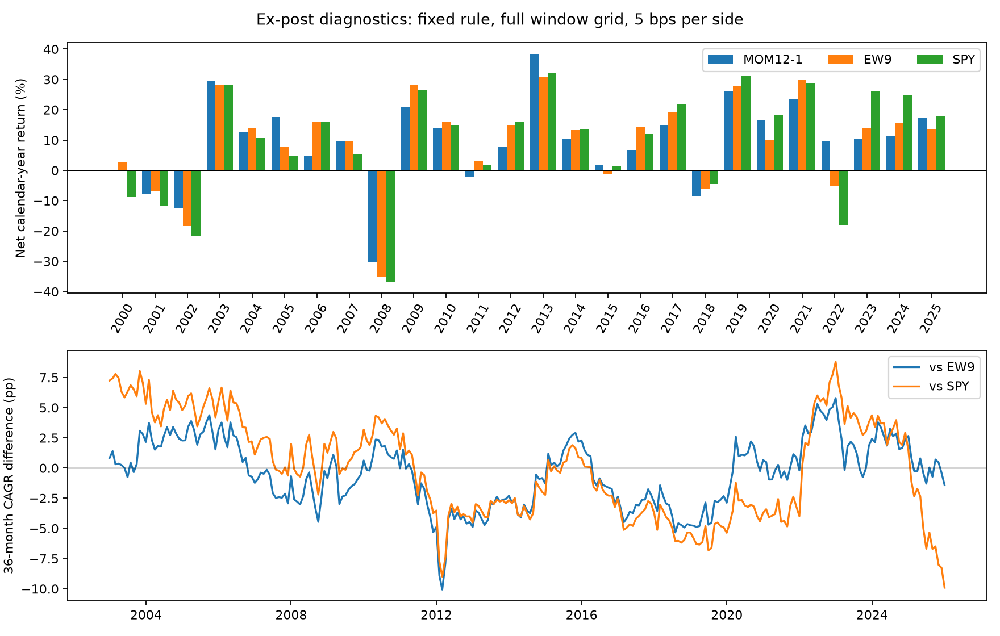

# Ex-post period and sector diagnostics

[Period and universe comparison report](regime_comparison.md)

This follows the original historical run. It retains the fixed MOM12−1 signal, top-three equal targets, next-close execution and 5 bps per-side costs. The original nine-sector full-history result remains in [../snapshot](../snapshot).

The comparison publishes the complete search grid: 26 calendar years, five disjoint five-year blocks plus the remaining year, and 277 monthly-start three-year windows. Example years and extrema are selected after inspecting this grid. Overlapping windows are dependent and their counts are not independent win probabilities.

`annual_sector_contributions.csv` records nine-sector portfolio dollar P&L divided by each year's starting NAV. Fees appear separately as COST. These are held-position contributions, not ETF buy-and-hold returns or factor alpha.

The expanded comparison adds the real-estate and communication-services ETF products. The two universes both form from cash at the first January 2020 session's close after sufficient actual ETF history. Base nine-sector/SPY prices are identical. These newly formed accounts are separate from slicing the original January 2000 continuous account. Compare each momentum portfolio against its corresponding EW9/EW11 and the common SPY account.

- `universe_comparisons.csv`: complete common-period, annual and rolling grid.
- `universe_annual_contributions.csv`: annual portfolio P&L decomposition in both universes.
- `universe_holdings_comparison.csv`: all 72 monthly selections and added/removed names.
- `universe_selection_counts.csv`: how often each ETF was selected at monthly execution.
- `expanded_data_manifest.json`: additional supplier input identities and official product links; no pre-inception backfill.
- `exploration.json`: methods, coverage, source identities, input hashes and selection limitations.

Raw vendor data and local execution logs are not redistributed here. Download and reproduce with the `explore` command in the repository README. Favorable cases describe observed paths; a rule that identifies them in advance would require separate prospective validation.

